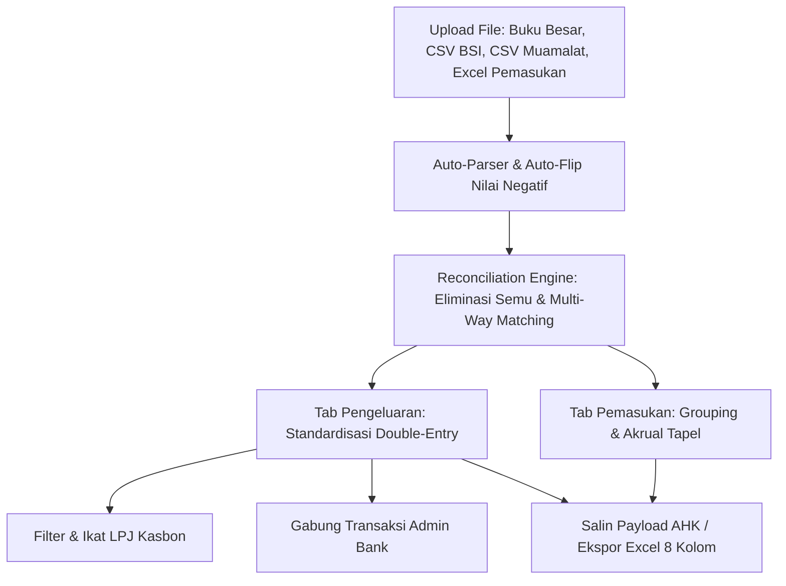

# 🏛️ Sistem Keuangan Terpadu — Pesantren Ibnu Taimiyah

Aplikasi web modern berbasis **Vue 3** yang dirancang khusus untuk memproses, merekonsiliasi, dan mengotomatisasi pencatatan jurnal keuangan di lingkungan **Pesantren Ibnu Taimiyah**.

Aplikasi ini menyatukan mutasi rekening koran bank (_Bank BSI & Bank Muamalat_), transaksi kas kecil/buku besar harian, serta laporan penerimaan siswa ke dalam format jurnal akuntansi standar berpasangan (_Double-Entry Accounting_ 100% seimbang) yang siap diimpor ke sistem akuntansi pusat atau disalin via AutoHotkey (AHK).

---

## 📑 Daftar Isi

- [Latar Belakang & Masalah yang Diselesaikan](#-latar-belakang--masalah-yang-diselesaikan)
- [Fitur Utama](#-fitur-utama)
- [Struktur Alur Kerja (Workflow)](#-struktur-alur-kerja-workflow)
- [Format & Integrasi Payload AHK](#-format--integrasi-payload-ahk)
- [Struktur Folder Proyek](#-struktur-folder-proyek)
- [Panduan Instalasi & Menjalankan](#-panduan-instalasi--menjalankan)
- [Format File Input yang Didukung](#-format-file-input-yang-didukung)
- [Hak Cipta](#-hak-cipta)

---

## 🎯 Latar Belakang & Masalah yang Diselesaikan

Pencatatan keuangan pesantren sering menghadapi kompleksitas transaksi:

1. **Transaksi Semu / Jembatan Bank:** Kasir kas kecil sering mencatat mutasi masuk/keluar ganda (_KP=2_ / _KK=2_) saat mentransfer atau menarik dana dari bank. Sistem ini secara otomatis melakukan **Eliminasi 3-Arah** untuk mempertahankan mutasi bank riil dengan deskripsi belanja kasir asli.
2. **Penyelesaian Kasbon / LPJ:** Pengeluaran kasbon uang muka yang dipertanggungjawabkan bersama belasan nota belanja sering kali menimbulkan kebingunan. Sistem ini otomatis menghitung selisih dan membuat baris penyeimbang kas/bank (_Reimburse_ atau _Pengembalian Sisa Kasbon_).
3. **Akrual Pendapatan Siswa:** Memetakan pembayaran SPP, PSB, dan Pembangunan siswa ke periode tahun ajaran yang tepat (_Tapel Lalu/Piutang_, _Tapel Sekarang/Pendapatan_, atau _Tapel Depan/Pendapatan Diterima Dimuka_).

---

## ✨ Fitur Utama

### 1. 🔄 Rekonsiliasi Mutasi Riil Bank (BSI & Muamalat)

- **Eliminasi 3-Arah Otomatis:** Membuang baris semu kasir (_Tambahan Kas Bank_ & _Realisasi Kas Kecil_) dan mengadopsi teks belanja kasir ke baris mutasi bank riil.
- **Smart Matching (1-to-1 & 1-to-N Split):** Algoritma penilaian kecocokan berdasarkan kedekatan tanggal, nominal, nama penerima, dan kata kunci belanja.
- **Audit Trail Log:** Tab khusus untuk melacak seluruh histori transaksi yang direkonsiliasi dan dieleminasi.

### 2. 📑 Manajemen Kasbon & Ikat LPJ (100% Balance)

- **Pembeda Cerdas Kasbon:**
  - **Kasbon Baru (Uang Muka Keluar):** Otomatis diposisikan di **DEBET** dengan label biru `KASBON`.
  - **Pelunasan Kasbon (Laporan LPJ):** Otomatis diposisikan di **KREDIT** dengan label oranye `PELUNASAN KASBON` dan penanda khusus **`PERLU DIIKAT LPJ`**.
- **Auto-Balancing Engine:** Fitur _Ikat LPJ Kasbon_ menjumlahkan total nota belanja (Debet) vs kasbon ditutup (Kredit) dan membuat jurnal penyeimbang secara otomatis jika ada selisih uang kembali/reimburse.

### 3. 🏷️ Filter Canggih & Seleksi Cepat

- **Filter Multifaktor:** Filter berdasarkan Tanggal, Akun Kas/Bank, Penerima, Label Kategori Transaksi, dan Sumber Mutasi.
- **Pill Reset Instan:** Badge filter aktif dengan tombol `✕` untuk menghapus filter penerima/label dengan 1 klik.
- **Pilih Semua yang Tampil (Select All Filtered):** Checkbox pintar di header tabel yang hanya memilih baris aktif sesuai filter yang sedang diterapkan.

### 4. 💰 Jurnal Otomatis Pemasukan Siswa

- Otomatis mengelompokkan penerimaan berdasarkan tanggal, kas/bank penerima, pos penerimaan, dan tahun ajaran (Tapel).
- Pengelompokan kategori akrual otomatis: `TAPEL SEKARANG`, `TAPEL AKAN DATANG`, atau `TAPEL LALU`.

### 5. 🔗 Konsolidasi Mutasi Bank (Merge)

- Menggabungkan transaksi sejenis (misal: puluhan biaya admin e-banking) menjadi 1 baris jurnal konsolidasi dengan perhitungan nominal otomatis.

### 6. ✏️ Modal Edit COA & Deskripsi Universal

- Edit cepat bagan akun (COA) dan uraian standar langsung dari baris tabel mana pun dengan integrasi Master COA Pesantren.

### 7. 📊 Ekspor Excel & Copy Payload AHK

- **Ekspor Excel 8 Kolom:** Format baku akuntansi (_No Batch, Tanggal, Uraian, Kode Akun, Nama Akun, Posisi, Debit, Kredit_).
- **Copy Payload 1-Klik:** Format teks clipboard khusus yang siap dibaca oleh skrip AutoHotkey (AHK) untuk entri ke software akuntansi yayasan.

---

## 🛠️ Alur Kerja (Workflow)

